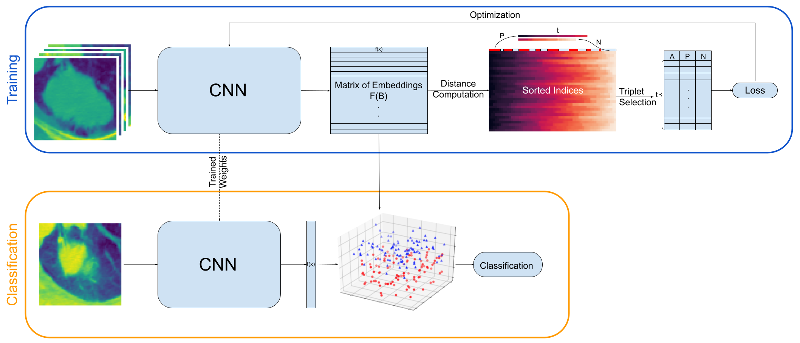

# Early Experiences on using Triplet Networks for Histological Subtype Classification in Non-Small Cell Lung Cancer
<p align="center"></p>

## Citation

If you find this repository or the associated paper useful for your research, please cite it as follows:

```bibtex
@inproceedings{aksu2023early,
  title={Early experiences on using triplet networks for histological subtype classification in non-small cell lung cancer},
  author={Aksu, Fatih and Gelardi, Fabrizia and Chiti, Arturo and Soda, Paolo},
  booktitle={2023 IEEE 36th International Symposium on Computer-Based Medical Systems (CBMS)},
  pages={832--837},
  year={2023},
  organization={IEEE}
}
